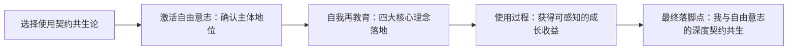
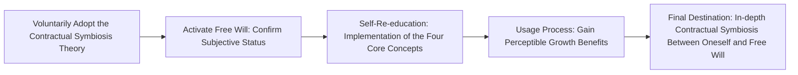

# 模块3：核心解决方案（落地核心）

## Module 3: Core Solution (Implementation Core) 

### 模块定位

#### Module Positioning

从「半觉醒」到「完全觉醒」的可执行落地路径，以「选择使用」为起点，通过四大核心理念完成自我再教育，激活自由意志、确认主体地位，最终实现「我与自由意志」的深度契约共生。

An executable implementation path from "semi-awakening" to "complete awakening", starting with "voluntary adoption", completing self-re-education through the four core concepts, activating free will, confirming one’s subjective status, and ultimately achieving in-depth contractual symbiosis between "oneself and free will".

### 一、核心框架

#### I. Core Framework

### 二、落地步骤：从「选择」到「共生」的全流程

#### II. Implementation Steps: Full Process from "Choice" to "Symbiosis"

##### 第一步：选择使用——启动自我觉醒的开关（0→1的关键）

###### Step 1: Voluntary Adoption - Activate the Switch of Self-Awakening (Key from 0 to 1)

#### 底层逻辑

#### Underlying Logic

自由意志的第一性是「自愿选择」，拒绝被动接受传统、舆论、情绪的裹挟。

The primacy of free will lies in "voluntary choice", and we should refuse to passively submit to the influence of tradition, public opinion, and emotions.

#### 可执行动作

#### Executable Actions

1. 写下「我为什么选择契约共生论」的3个核心理由（必须基于自我需求，而非外部要求）；

1. Write down 3 core reasons for "why I voluntarily adopt the Contractual Symbiosis Theory" (must be based on personal needs, not external demands);

2. 完成「拒绝被动」清单：列出3件你因他人/环境裹挟而做、但违背自我意志的事，明确停止/调整方式；

2. Complete the "Reject Passivity" list: List 3 things you did against your will due to the coercion of others or the environment, and clearly define the way to stop or adjust them;

3. 立下「自我契约第一条」：“我所有的选择，优先基于自我意志，而非讨好、恐惧、道德绑架”。

3. Establish the "First Self-Contract": "All my choices are based on my free will first, rather than pleasing others, succumbing to fear, or being morally coerced."

#### 目标

#### Goal

从「被安排」转向「我做主」，确认自己的主体地位。

Shift from "being arranged" to "taking charge of oneself", and confirm one’s subjective status.

##### 第二步：自我再教育——四大核心理念的落地实践（核心环节）

###### Step 2: Self-Re-education - Practical Implementation of the Four Core Concepts (Core Link)

#### 1. 自由意志：锚定「我想要什么」

#### 1. Free Will: Anchor "What I Truly Want"

##### 核心问题

##### Core Question

区分「我真的想要」和「别人希望我想要」。

Distinguish between "what I truly want" and "what others hope I want".

##### 落地工具：「自由意志清单」

##### Implementation Tool: "Free Will List"

|类别|具体内容（示例）|Category|Specific Content (Example)|
|---|---|---|---|
|我真的想要|1. 拥有可自主支配的时间；2. 不委屈自己的边界|What I Really Want|1. Have freely disposable time; 2. Do not wrong my own boundaries|
|别人希望我|1. 必须结婚生子；2. 要“懂事”“顾全大局”|What Others Hope I Want|1. Must get married and have children; 2. Be "sensible" and "consider the overall situation"|
##### 实践动作

##### Practical Actions

每周复盘1次，删除1条「别人希望我」的内容，强化1条「我真的想要」的行动。

Review once a week, remove one item from "what others hope I want", and strengthen one action related to "what I truly want".

#### 2. 权责统一：理清「我有什么/我愿付出什么」

#### 2. Unity of Rights and Responsibilities: Clarify "What I Have / What I Am Willing to Give"

##### 核心问题

##### Core Question

拒绝「只想要不付出」「只付出无回报」的失衡状态。

Reject the unbalanced states of "only wanting without giving" and "only giving without receiving anything in return".

##### 落地工具：「权责对等表」

##### Implementation Tool: "Rights and Responsibilities Balance Table"

|我想要的目标|我拥有的资源|我愿意付出的代价|The Goal I Want|The Resources I Have|The Price I Am Willing to Pay|
|---|---|---|---|---|---|
|职业自主选择权|专业技能、时间|放弃稳定但无意义的加班|Right to Professional Autonomy|Professional skills, time|Give up stable but meaningless overtime work|
|亲密关系的平等|尊重、沟通能力|放弃“索取情绪价值”的执念|Equality in Intimate Relationships|Respect, communication skills|Give up the obsession with "demanding emotional value"|
##### 实践动作

##### Practical Actions

每达成1个小目标，复盘「付出-收获」是否对等，拒绝“白嫖”思维、拒绝“牺牲式付出”。

After achieving each small goal, review whether the "effort-reward" is balanced, reject the "free-ride" mentality, and avoid "sacrificial giving".

#### 3. 契约边界：明确「我不接受什么」

#### 3. Contract Boundaries: Clarify "What I Do Not Accept"

##### 核心问题

##### Core Question

守住自我领地，也尊重他人领地。

Guard your own territory and respect the territory of others.

##### 落地工具：「边界宣言」（写下来并告知关键人）

##### Implementation Tool: "Boundary Declaration" (Write it down and inform key people)

> 示例：
> 
> 1. 我的私人时间（22:00-8:00）不接受工作打扰；
> 
> 2. 我不接受他人评判我的人生选择（如婚育、职业）；
> 
> 3. 我尊重他人的边界，也要求他人尊重我的。
> 
> 

> Example:
> 
> 1. My private time (22:00-8:00) is free from work interruptions;
> 
> 2. I do not accept others judging my life choices (such as marriage, childbirth, or occupation);
> 
> 3. I respect the boundaries of others and require others to respect mine.
> 
> 

##### 实践动作

##### Practical Actions

第一次被越界时，用清晰、温和的语言重申边界（而非情绪化对抗/隐忍）。

When your boundary is crossed for the first time, reaffirm it in clear and gentle language (instead of emotional confrontation or forbearance).

#### 4. 平等共生：构建「我与他人的共赢关系」

#### 4. Equal Symbiosis: Build a "Win-Win Relationship with Others"

##### 核心问题

##### Core Question

从「支配/依附」转向「互相成就」。

Shift from "dominance/dependence" to "mutual achievement".

##### 落地工具：「共生关系清单」

##### Implementation Tool: "Symbiotic Relationship List"

|关系对象|我能提供的价值|我希望获得的价值|共赢的验证标准|Relationship Object|The Value I Can Provide|The Value I Hope to Obtain|Verification Standard for Win-Win|
|---|---|---|---|---|---|---|---|
|伴侣|尊重、支持|平等、理解|双方都有安全感|Partner|Respect, support|Equality, understanding|Both parties feel a sense of security|
|同事|专业协作|公平的评价|工作效率提升|Colleague|Professional collaboration|Fair evaluation|Improved work efficiency|
##### 实践动作

##### Practical Actions

每月和关键关系人沟通1次「价值交换」感受，调整不对等的部分。

Communicate with key relationship partners once a month about your feelings regarding "value exchange" and adjust any unbalanced parts.

##### 第三步：使用过程中的可感知好处（强化正向循环）

###### Step 3: Perceptible Benefits in the Usage Process (Strengthening the Positive Cycle)

|成长阶段|具体好处|验证方式|Growth Stage|Specific Benefits|Verification Method|
|---|---|---|---|---|---|
|短期（1-3个月）|1. 内耗减少：不再因“该不该”纠结；2. 边界清晰：减少被侵犯的委屈；3. 自我认同提升：不再靠他人评价定义自己|情绪日记：记录“内耗时刻”的减少次数|Short-term (1-3 months)|1. Reduced internal friction: No longer tangled about "should or should not"; 2. Clear boundaries: Reduced grievances from being violated; 3. Enhanced self-identity: No longer define yourself through others' evaluations|Emotion Diary: Record the decrease in "moments of internal friction"|
|中期（3-6个月）|1. 关系更健康：远离消耗型人际关系；2. 决策更果断：基于自我意志的选择更坚定；3. 责任感可控：不再逃避/过度承担|复盘决策：记录“后悔的选择”减少次数|Medium-term (3-6 months)|1. Healthier relationships: Stay away from energy-draining interpersonal relationships; 2. More decisive decision-making: Choices based on free will are more firm; 3. Controllable sense of responsibility: No longer avoid or take on excessive responsibility|Decision Review: Record the decrease in "regrettable choices"|
|长期（6个月+）|1. 人格完整：不再依附他人获得安全感；2. 共生能力：能和他人建立共赢关系；3. 自我稳定：情绪、决策不随外部波动|人生满意度评分：每月打分（1-10分）|Long-term (6 months+)|1. Complete personality: No longer rely on others for a sense of security; 2. Symbiotic ability: Able to establish win-win relationships with others; 3. Self-stability: Emotions and decisions do not fluctuate with external factors|Life Satisfaction Score: Rate monthly (1-10 points)|
##### 第四步：最终落脚点——「我与自由意志」的深度契约共生

###### Step 4: Final Destination - In-depth Contractual Symbiosis Between "Oneself and Free Will"

#### 核心状态

#### Core State

1. 自我和解：接受自己的欲望、边界、不完美，不再内耗；

   Self-reconciliation: Accept your desires, boundaries, and imperfections, and eliminate internal friction;

2. 自我掌控：所有选择基于「我愿意」，而非「我不得不」；

  Self-control: All choices are based on "I am willing" rather than "I have to";

3. 自我延续：以完整的自我与世界共生，既不掠夺他人，也不委屈自己。

  Self-continuation: Coexist with the world as a complete self, neither plundering others nor wronging yourself.

#### 最终契约（可落地的自我承诺）

#### Final Contract (Implementable Self-Commitment)

> “我以自由意志为根基，明确权责、守住边界、平等共生，始终对自己的选择负责，最终活成自己想要的、完整的样子。”
> 
> 

> "With free will as my foundation, I clarify my rights and responsibilities, guard my boundaries, and pursue equal symbiosis. I will always be responsible for my choices and ultimately live the complete life I desire."
> 
> 

### 三、配套资源

#### III. Supporting Resources

### 1. 模板文件（可直接填写）

### 1. Template Files (Ready to Fill In)

- 自由意志清单.md

- Free Will List.md

- 权责对等表.md

- Rights and Responsibilities Balance Table.md

- 边界宣言.md

- Boundary Declaration.md

- 共生关系清单.md

- Symbiotic Relationship List.md

### 2. 复盘工具

### 2. Review Tools

- 周复盘模板：聚焦「自我意志-行动-收益」闭环

- Weekly Review Template: Focus on the "free will-action-benefit" closed loop

- 月复盘模板：聚焦「成长阶段-好处验证-调整方向」

- Monthly Review Template: Focus on "growth stage-benefit verification-adjustment direction"

### 3. 案例库

### 3. Case Library

- 案例1：从“被迫结婚”到“自主选择婚恋状态”的落地实践

- Case 1: Practical Implementation from "Forced Marriage" to "Independently Choosing Marital and Romantic Status"

- 案例2：从“职场讨好型人格”到“权责对等协作”的转变过程

- Case 2: Transformation Process from "Workplace People-Pleaser Personality" to "Collaboration with Equal Rights and Responsibilities"

- 案例3：从“情绪内耗”到“自我稳定”的6个月成长记录

- Case 3: 6-Month Growth Record from "Emotional Internal Friction" to "Self-Stability"

### 4. 常见问题（Q&A）

### 4. Frequently Asked Questions (Q&A)

|问题|解答|Question|Answer|
|---|---|---|---|
|选择自由意志会不会变成“自私”？|自由意志的核心是「不侵犯他人」，自私是「只考虑自己、掠夺他人」，契约共生论的边界原则已明确区分二者；自由意志的选择，始终以“不越界、共生长”为前提。|Will choosing free will become "selfish"? |The core of free will is "not infringing on others", while selfishness is "only considering oneself and plundering others". The boundary principle of the Contractual Symbiosis Theory clearly distinguishes between the two; choices based on free will are always premised on "not crossing boundaries and growing together".|
|短期付出无回报，要不要放弃？|权责统一的核心是「长期对等」，短期失衡可调整契约内容（如重新界定付出/收获范围），但不放弃“自我负责”的底层逻辑；短期无回报需先复盘“目标/资源/代价”是否匹配，而非直接放弃。|If there is no return for short-term efforts, should we give up? |The core of the unity of rights and responsibilities is "long-term equality". For short-term imbalances, the contract content can be adjusted (such as redefining the scope of efforts and rewards), but the underlying logic of "self-responsibility" should not be abandoned; if there is no short-term return, first review whether the "goal/resources/cost" are matched before considering giving up.|
|边界被反复越界，该怎么办？|第一步：重申边界（清晰、无情绪）；第二步：设定越界后果（如减少互动、暂停合作）；第三步：执行后果（不妥协）；核心是“言行一致”，而非“忍到爆发”。|What if the boundary is repeatedly crossed? |Step 1: Reaffirm the boundary (clearly and without emotion); Step 2: Set consequences for crossing the boundary (such as reducing interaction or suspending cooperation); Step 3: Enforce the consequences (without compromise); the core is "consistency in words and deeds", not "enduring until explosion".|
|平等共生是否意味着“无原则妥协”？|平等共生的核心是「价值对等交换」，而非“无原则让步”；若对方无法提供对等价值，可选择终止共生关系，而非牺牲自我边界换取“表面和平”。|Does equal symbiosis mean "unprincipled compromise"? |The core of equal symbiosis is "equal value exchange", not "unprincipled concession"; if the other party cannot provide equal value, you can choose to terminate the symbiotic relationship instead of sacrificing your own boundaries for "superficial peace".|
### 总结

#### Summary

1. 本模块以「选择使用」为起点，通过四大核心理念的**可落地工具**，完成从“被动接受”到“主动掌控”的自我再教育；

  Starting with "voluntary adoption", this module completes self-re-education from "passive acceptance" to "active control" through the **practical, implementable tools** of the four core concepts;

2. 核心逻辑是「始于自我意志，终于自我共生」，所有动作围绕“激活自由意志、确认主体地位”展开；

  The core logic is "starting with free will and ending with self-symbiosis", with all actions centered on "activating free will and confirming subjective status";

3. 落地的关键是「小步迭代、正向强化」——每一次清单填写、每一次边界坚守，都是对“我与自由意志”契约的强化，最终实现完全觉醒。

  The key to implementation is "small-step iteration and positive reinforcement" — every time you fill out a list or uphold a boundary, it strengthens the contract between "oneself and free will", ultimately achieving complete awakening.

---
协作辅助：豆包（字节跳动自研 AI） / Collaboration Assistant: Doubao (ByteDance Self-developed AI)
